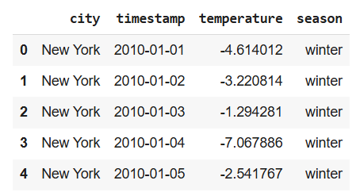
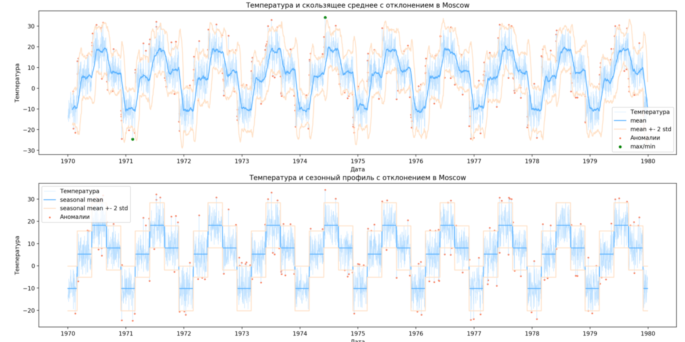

## Анализ температурных данных и мониторинг текущей температуры через OpenWeatherMap API

### Запуск

Установка зависимостей:

`pip install -r requirements.txt`

Запускаем сервис:

`streamlit run app.py`

### Использование

На странице сервиса загружаем датасет. Формат данных:

Далее выбираем город для отображения статистики. Пример графика для Москвы:

Сервис позволяет получить текущий прогноз погоды с использованием OpenWeatherMap API, для этого необходимо указать API ключ в соответствующем поле. Относительно имеющихся данных определяется аномальность текущей температуры, а также прогноз через месяц.

